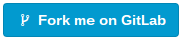

# fork-me-on-gitlab



A simple HTML `Fork me on GitLab` button:

```html
<iframe src="http://htmlpreview.github.io/?https://github.com/AurelienLourot/fork-me-on-gitlab/master/button.html?href=https://gitlab.com/you"
        frameborder="0" scrolling="0" width="180px" height="35px"></iframe>
```

See
[result](http://htmlpreview.github.io/?https://github.com/AurelienLourot/fork-me-on-gitlab/blob/master/example-inline.html).

## Idea

I couldn't find any `Fork me on GitLab` button or ribbon. So I've decided to make one following
GitLab's fork button style.

## Examples

### In the text

[example-inline.html](example-inline.html)

See
[result](http://htmlpreview.github.io/?https://github.com/AurelienLourot/fork-me-on-gitlab/blob/master/example-inline.html).

### In the corner

```html
<iframe src="http://htmlpreview.github.io/?https://github.com/AurelienLourot/fork-me-on-gitlab/master/button.html?href=https://gitlab.com/you"
        style="position: absolute; top: 15px; right: 15px;"
        frameborder="0" scrolling="0" width="180px" height="35px"></iframe>
```

See
[result](http://htmlpreview.github.io/?https://github.com/AurelienLourot/fork-me-on-gitlab/blob/master/example-corner.html).

## Initial author

[Aurelien Lourot](https://ghuser.io/AurelienLourot)
